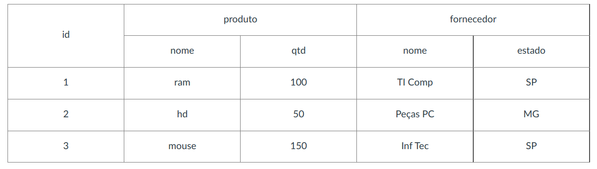

# Exercícios Hbase
## 1. Criar a tabela ‘controle’ com os dados:

Chave: id
Família de Coluna: produto e fornecedor



```
hbase shell
create 'controle','produto','fornecedor'
put 'controle','1','produto:nome','ram'
put 'controle','1','produto:qtd','100'
put 'controle','1','fornecedor:nome','TI Comp'
put 'controle','1','fornecedor:estado','SP'

put 'controle','2','produto:nome','hd'
put 'controle','2','produto:qtd','50'
put 'controle','2','fornecedor:nome','Peças PC'
put 'controle','2','fornecedor:estado','MG'

put 'controle','3','produto:nome','mouse'
put 'controle','3','produto:qtd','150'
put 'controle','3','fornecedor:nome','Inf Tec'
put 'controle','3','fornecedor:estado','SP'
```
## 2. Listar as tabelas e verificar a estrutura da tabela ‘controle’
```
list
describe ‘controle’
```
## 3. Contar o número de registros da tabela ‘controle’
```
count 'controle'
```
## 4. Alterar  a família de coluna produto para 3 versões
```
alter 'controle',{NAME=>'produto',VERSIONS=>3}
describe ‘controle’
```
## 5. Alterar a quantidade para 200 do id 2
```
put 'controle','2','produto:qtd','200'
```
## 6. Pesquisar as versões do id 2  da coluna quantidade
```
get 'controle','2',{COLUMNS=>'produto:qtd', VERSIONS=>2}
```
## 7. Excluir os id do estado de SP
```
scan 'controle',{COLUMNS=>'fornecedor:estado', LIMIT=>5, FILTER=> "ValueFilter(=,'binary:SP')"}
deleteall 'controle','1'
deleteall 'controle','3'
```
## 8. Deletar a coluna estado da chave 2
```
delete 'controle','2','fornecedor:estado'
```
## 9. Pesquisar toda a tabela controle
```
scan 'controle'
```