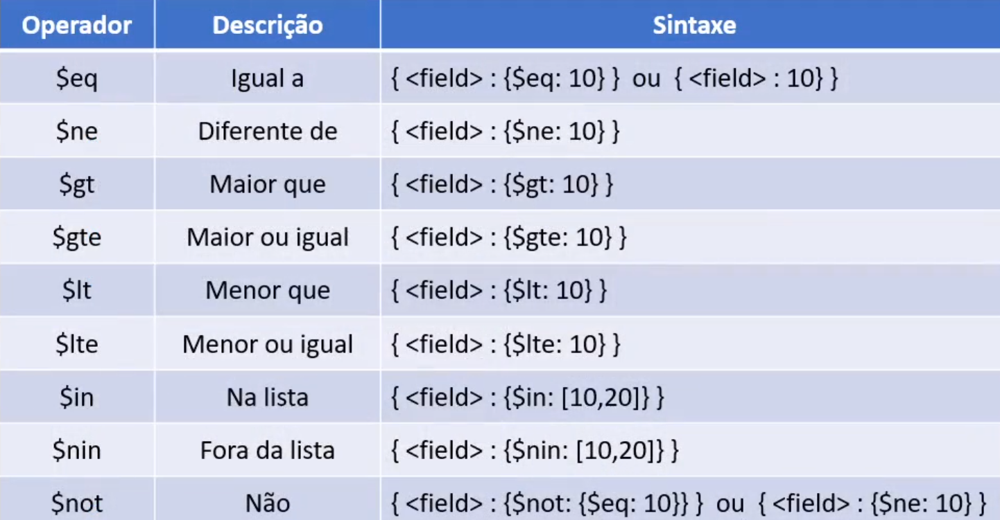
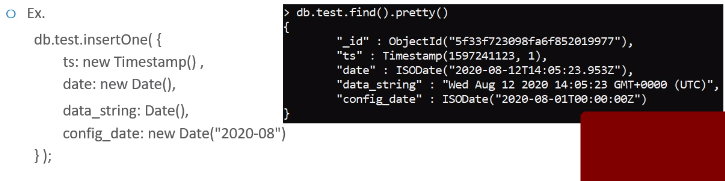

## Create bd
```
use <db>

show dbs -> mostras bancos com documentos
db -> checka qual banco vc está
```

## drop bd
```
db.dropDatabase()
```

## Create collection
```
db.createCollection('<nomeCollection>')
show collections
```

## Drop collection
```
db.<nomeCollection>.drop()
show collections
```

## Rename collection
```
db.<nomeCollection>.renameCollection(<newCollectionName>)
show collections
```

## Inserir documentos
```
- Inserir um documento

db.<nomeCollection>.insertOne({<documento>})

- Inserir vários documentos

db.<nomeCollection>.insertMany({<documento1>},{<documento2>},{<documento3>})

- Exemplo

db.cliente.insertOne({
    
    nome: "Lucas",
    idade: 20,
    conhecimento: "Linux"
    
    })

db.cliente.insertMany({
    
    nome: "Carlos",
    idade: 23,
    conhecimento: "Linux"
    
    },{
     nome: "carla"
    })
```
## Query collection
```
db.<nomeCollection>.find().prety()

db.<nomeCollection>.find({<criterioConsulta>},{<projecao>}).

db.cliente.find({nome:"João"},{conhecimento:0})
    - não mostra campo conhecimento

db.cliente.find({nome:"João"},{conhecimento:1})
    - só mostra campo conhecimento e id

- Projeção

Campos que serão exibidos ou esondidos


- Criterio de consulta
{<atributo>:{operador:valor}}

Ex: db.cliente.find({nome:"João"})
    db.cliente.find({endereco.logradouro:"Avenida"})
    db.cliente.find({idade:{$lt:18}})

Operadores:
```



## Operador OR
```
db.cliente.find({
    $or:[
        {"endereco.cidade":"Sao Paulo"},
        {idade:{$gte:18}}
    ]
})
```

## Operador AND e OR
```
db.cliente.find({
   conhecimento:"windows",
   {$or:
   [
        {"endereco.cidade":"Sao Paulo"},
        {idade:{$gte:18}}
    ]
    }
})
```

## Ordenando
```
db.<nomeCollection>.find({}).sort({<atributo>:<valor>})

Ordenação ascendente
.sort({<atributo>:1})

Ordenação descendente
.sort({<atributo>:-1})

Ex: 
db.cliente.find({}).sort({"endereco.cidade":1, nome:1})
```

## Limit
```
Mostrar 5 primeiros clientes
db.cliente.find({}).limit(5)
```

## Campos date
```
Date() -> retorna data atual
new Date() -> retorna data atual como utc
new Date(<yyyy-mm-dd>) -> retorna data informada como utc
timestamp()
```




## Criar Index
```
db.collection.createIndex(<key>,<opcoes>)

key -> <atributo>:<valor>
valor 
    1 -> ascendente 
    -1 descendente

ex:

db.collection.createIndex({nome:1},{name:query itens})
db.collection.getIndexes()

- show indexes
db.collection.getIndexes()

- index exclusivo
db.collection.createIndex({user_id:1}, {unique:true})

- apagar index
db.collection.dropIndex({user_id:1})
```

## Query Index
```
db.cliente.find().hint({nome:1})
```

## Query Regex
```
db.cliente.find({{<field>:{$regex:/pattern/,$options:'<options>'}}}
db.cliente.find({{<field>:{$regex:pattern',$options:'<options>'}}}
db.cliente.find(}

options

i - ignorar case-sensitive
m - combinar várias linhas
    incluir ancoras ^ no inicio e $ no final

exemplo:
Retornar os cpfs que contenham letras

db.cliente.find({cpf:{regex:"[a-z]"}})
```

## Update
```
- Atualizar um documento

db.<nomeCollection>.updateOne({<filtro>},{<atualizacao>})

- Atualizar vários documentos

db.<nomeCollection>.updateMany({<filtro>},{<atualizacao>})

- Filtro é o criterio de consulta

{<atributo>:{<operador>:<valor>}}

- Atualizacao

{<operadorAtualizacao>:{<atributo>:<valor>,<atributo>:<valor>,...}}

- operadorAtualizacao

Operador Set
    - Atualiza/cria atributo

db.cliente.updateOne({
    {_id:1},
    {$set:{idade:25, estado:"SP"}}
    })

db.cliente.updateMany({
    {idade:{$gt:27}},
    {$set:{seguro_carro:"Baixo"}}
    })

Operador UnSet
    - remove o atributo


db.cliente.updateOne({
    {_id:1},
    {$unset:{idade:""}}
    })
```

## Update campos Date 
```
- Operador currentDate
seta um valor da data atual

db.cliente.updateMany({
    {idade:{$gt:27}},
    {$set:{seguro_carro:"Baixo"}},
    $currentDate: {atualizado: {$type: "timestamp"}}
    })


```


## Crud em campos Array 
```
- Operador set
atualiza um elemento do array
operador $ - atualiza o primeiro elemento da pesquisa em relação ao filtro

db.cliente.updateMany({
    {idade:{$gt:27}},
    {$set:{"conhecimento.$":"MongoDB"}}
    })

- Adicionar elemento no Array
Operador push

db.cliente.updateOne({_id:2},{$push: {conhecimento:"Redis"}})

- Remover elemento no Array
Operador pull

db.cliente.updateOne({_id:2},{$pull: {conhecimento:"Redis"}})


```


## Alterar nome dos atributos
```
Operador Rename

db.cliente.updateMany({
    {},
    {$rename:{"nome":"nome_completo"}}
    })
```

## Agregações
```
- Count

db.cliente.count()
db.cliente.find({cidade: "São Paulo"}).count()

- Distinct

cb.cliente.diistinct("atributo")

- Agregações de pipeline

https://docs.mongodb.com/manual/core/aggregation-pipeline/

```